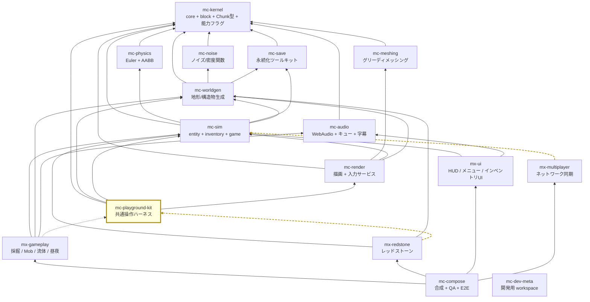

# アーキテクチャ

## 1. 4階層

plan.md §2.2 の 4 階層。**リポジトリ = 検証・リリースの単位**であり、パッケージ（依存境界）や
プレビュー（起動）とは別の単位である（plan.md §2.4。混同しないこと）。

| 階層 | リポジトリ | 性質 |
| --- | --- | --- |
| 安定ライブラリ | kernel / noise / meshing / physics / save / audio | 純粋関数・狭い界面・変更頻度が低い。相互独立で並行構築可能 |
| **基盤** | worldgen / sim / render / **kit** | 状態とサービス（**名詞**）。体験モジュールが乗る土台 |
| 体験モジュール | gameplay / redstone / ui / multiplayer | ルールとUI（**動詞**）。互いを知らず、基盤サービス経由でのみ会話 |
| 合成 | compose | Layerマージ + stage順序表 + E2E。ロジックを持たない |

mc-playground-kit は**基盤**層にいるが、基盤の中で唯一の異物である。

**worldgen / sim / render は出荷される。kit は出荷されない。**
同じ層に置かれているのは「体験モジュールが乗る土台」という性質が同じだからであって、
ライフサイクルは根本的に違う。§4.2 がこの違いの帰結をすべて列挙する。

## 2. 依存グラフ全体（16リポジトリ）

実線 = 実行時依存（`dependencies`）、点線 = プレビュー起動時のみ（`devDependencies`）。
`mc-kernel` はどこからでも import 可能なため、矢印は引くが許可リストには書かない。



**kit に入ってくる実線は 1 本もない。** これがこのグラフから読み取るべき一番大事なことである。
kit を指す矢印は 2 本の**点線**（`gameplay -.-> kit` と `redstone -.-> kit`）だけであり、
点線は依存グラフの行ではない（§4.2.3）。

### 15 と 16 の数え方

plan.md の見出しと §2.4 は「**15 リポジトリで固定**」と書き、§6 Step 0 が別途
`mc-dev-meta` workspace の作成を指示している。つまり:

- **ゲームを構成するリポジトリ = 15**（kernel / noise / meshing / physics / save / audio /
  worldgen / sim / render / kit / gameplay / redstone / ui / multiplayer / compose）
- **依存ホワイトリストが知るべきリポジトリ = 16**（上記 + `mc-dev-meta`）

`REPOSITORY_POLICY.dependencyGraph` は後者の 16 行を持つ。dev-meta は依存を 1 つも持たず
（`repos/` に clone を並べるだけ）、誰からも依存されないため、循環検査には影響しない。
行を置くのは「16 リポジトリ全部について、意図が記録されている」状態にするためである。

このグラフは `scripts/check-dependency-whitelist.ts` の `REPOSITORY_POLICY.dependencyGraph` に
**全 16 行そのまま**記録されており、`pnpm check:deps` が循環検査を行う。
`test/check-dependency-whitelist.test.ts` が「16 行あること」「全体が非循環であること」
「kit を指す実行時エッジが 1 本も無いこと」を assert している。

## 3. mc-playground-kit の位置

### 3.1 親（kit が import してよいもの）— 4 リポジトリ

plan.md §3.10 の依存は「kernel / worldgen / sim / render（入力は render のものを利用）」。

| 依存先 | 何をもらうか | 現状 |
| --- | --- | --- |
| `mc-kernel` | 共有語彙。**どのリポジトリからも import 可**。ただし `package.json#dependencies` への記載は必要 | `domain/kernel-vocabulary.ts` に暫定ミラー |
| `mc-worldgen` | ミニ平地ワールドの生成 | `WorldProviderPort` として注入待ち |
| `mc-sim` | プレイヤー状態・スポーン・tick・`CameraPoseSnapshot` の読み取り | `SimulationPort` として注入待ち |
| `mc-render` | 描画一式 **と実行時入力サービス** | `RendererPort` / `InputPort` として注入待ち |

**現在の `dependencies` は `effect` のみ。** 4 つともまだ publish されていないため
（plan.md §6 Step 3 の bottom-up publish-then-pin）、必要な surface は
`application/preview-ports.ts` に Port として宣言し、実装は Layer で注入する形にしてある。
publish 後も Port のままにする理由は [design-notes.md](./design-notes.md) DN-07。

### 3.2 子（kit に依存するもの）— **実行時依存はゼロ**

| リポジトリ | 依存の種類（意図された最終形） | 何に使うか |
| --- | --- | --- |
| `mx-gameplay` | **devDependency のみ** | プレビュー 3 本（採掘場 / Mobアリーナ / 時間スライダー）の起動 |
| `mx-redstone` | **devDependency のみ** | 回路盤プレビューの起動 |
| その他 12 リポジトリ | 依存しない | — |

> **現状**: この表は**意図された最終形**である。
> **今日この kit を依存に持つリポジトリは 1 つも無い。**
> 16 リポジトリのどの `package.json` にも `@nerima-games/*` は 1 つも宣言されていない
> （どれもまだ publish されていないため。plan.md §6 Step 3 の bottom-up publish-then-pin）。
> 表に挙げたプレビューもまだ 1 本も存在しない（`apps/` ディレクトリ自体がどのリポジトリにも無い）。
> **にもかかわらずこの表は今日から意味を持つ。** `scripts/check-dependency-whitelist.ts` の
> roster がこの形を宣言しており、実装が入る前から違反を落とせるからである（§4.2）。

plan.md §2.1 のグラフでは点線 2 本。`mc-worldgen` / `mc-sim` / `mc-render` の内蔵プレビューも
実際には kit を使うことになるが、それは各リポジトリの `apps/preview-*/` から
devDependency として参照する形であり（mc-sim の [testing.md](https://github.com/nerima-games/mc-sim/blob/main/docs/testing.md) §2.1 が
同じ整理をしている）、やはり実行時依存にはならない。

### 3.3 推移閉包は禁止

kit の親は多い（4 つ）ので、推移で届く範囲も広い。**届くことと import してよいことは別である。**

| 届くもの | 経路 | kit から import すると |
| --- | --- | --- |
| `mc-meshing` | kit → render → meshing | `transitive-import` |
| `mc-physics` | kit → sim → physics | `transitive-import` |
| `mc-noise` | kit → worldgen → noise | `transitive-import` |
| `mc-save` | kit → sim → save | `transitive-import` |
| `mc-audio` | 届かない | `not-whitelisted` |
| `mx-*` / `mc-compose` | 届かない | `not-whitelisted` |

いちばん誘惑が強いのは **`mc-physics`** である。「プレイヤーがちゃんと地面に立っているか
ハーネス側で確かめたい」と思った瞬間に AABB クエリへ手が伸びる。
だが「地面に立っているか」に答えるのは mc-sim の仕事であり、ハーネスが独自に判定を持つと
「プレビューでは立っている / ゲームでは沈んでいる」が起きる。
`test/check-dependency-whitelist.test.ts` の `transitive-import` 回帰テストがこれを固定している。

## 4. 構成の成立条件（plan.md §2.3）

### 4.1 §2.3-1 基盤 = 名詞、体験 = 動詞

kit は基盤層なので**名詞**を扱う。より正確には、**名詞を組み立てるが、名詞を所有しない。**

| kit がやること | kit がやらないこと |
| --- | --- |
| ワールド / シミュレーション / レンダラ / 入力を、順番に、時間を測りながら立ち上げる | それらのどれかを実装する |
| 呼び出し側の frame stage を毎フレーム回す | stage の中身を書く |
| `CameraPoseSnapshot` を sim から render へ運ぶ | 姿勢を作る・書き換える |

**kit は「動詞」を 1 つも持たない。** 「掘ったらドロップする」も「夜になったら Mob が湧く」も
mx-gameplay にある。kit にゲームルールが 1 行でも入ったら、そのルールは出荷ビルドに存在しないまま
プレビューでだけ動くことになり、プレビューがゲームの証拠でなくなる。

判断に迷ったときの問い: **「この処理を消したら、出荷ゲームの挙動が変わるか」**。
変わるなら kit に置いてはいけない（kit は出荷されないので、変わりようがないはずである）。

### 4.2 §2.3-2 mc-playground-kit は devDependency 専用 — **本リポジトリの憲法**

plan.md §2.3-2 原文:

> **実行時入力サービスは mc-render が所有。** kit は devDependency 専用のため、
> kit に入力を置くと本番ゲームから入力が消える。
> kit の役割は「ミニ世界 + カメラ + レンダラ + 入力を1秒で束ねる糊」に限定

#### 4.2.1 なぜこれが「憲法」なのか

他の 15 リポジトリにとって、この規則は依存グラフのルールの 1 つにすぎない。
kit にとっては**存在様式そのもの**である。ここを間違えたときの症状を具体的に書く。

1. mx-gameplay の開発者が、プレビューで動く入力処理を便利だと思う
2. 出荷コードから `import { InputService } from '@nerima-games/mc-playground-kit'` する
3. ローカルでは動く（dev workspace には kit がある）
4. `pnpm build` は通る（TypeScript 的には何も間違っていない）
5. **出荷ビルドに kit が含まれないので、リリースされたゲームはキーボードに反応しない**

4 と 5 の間に人間のレビューしか無い状態にはしない、というのがこの規則である。

#### 4.2.2 何が機械的に強制されているか

`scripts/check-dependency-whitelist.ts` の `DEV_ONLY_PACKAGES` とルール 6。
**16 リポジトリすべてが同じスクリプトを持つ**ので、どのリポジトリで違反しても、
そのリポジトリ自身の CI が落ちる。

| 違反 | 検出ルール | どこで落ちるか |
| --- | --- | --- |
| `dependencies` に kit がある | `dev-only-package-in-dependencies` | そのリポジトリの `pnpm check:deps` |
| `index.ts` / `domain/` / `application/` から kit を import | `dev-only-package-in-shipped-source` | 同上 |
| `test/` / `scripts/` から kit を import（devDependency 宣言あり） | 違反ではない | — |

**既知の限界**: 本リポジトリ自身のコピーでは `dev-only-package-in-shipped-source` は発火しない。
`classifyImport` は自己 import を先に判定するため、`self-import` が勝つからである
（[design-notes.md](./design-notes.md) DN-01 に実測と対処を記録）。
つまり **この規則の import 側は、他の 15 リポジトリのコピーでのみ検証される**。
`package.json` 側（`dev-only-package-in-dependencies`）は本リポジトリからも発火する。

#### 4.2.3 点線を依存グラフの行にしない理由

plan.md §2.1 の `gameplay -.-> kit` / `redstone -.-> kit` は、
`REPOSITORY_POLICY.dependencyGraph` に**行として存在しない**。理由は
`scripts/check-dependency-whitelist.ts:163-168` が書いているとおり
「devDependency は実行時エッジではなく、dev-only パッケージは実行時循環に参加できない」から。

**「行にすると循環になるから」ではない。** これは実測で確認した（`test/check-dependency-whitelist.test.ts`
の `REGRESSION: modelling a dotted edge would mislabel a real violation`）:
`mx-gameplay -> kit` を足しても `findCycles` は空のままである。kit には入ってくる実行時エッジが
無いので、kit が循環を閉じることはそもそもできない。

実際の害はもっと地味で、もっと厄介である。**違反メッセージが嘘になる。**

| | `mx-gameplay` が `mc-render` を import したとき |
| --- | --- |
| 現状（点線を行にしない） | `not-whitelisted`「mc-render は mx-gameplay の直接依存ではない」— 正しい |
| 点線を行にした場合 | `transitive-import`「mx-gameplay → mc-playground-kit → mc-render で推移的にしか届かない。直接依存として宣言するか、import をやめよ」 |

後者は、**出荷ビルドに存在しない経路**を根拠に「推移的には届いている」と言っている。
言われた開発者は kit 経由の経路が実在すると思い込む。実行時には存在しないのに。

### 4.3 §2.3-3 stage 実行順序表は compose が唯一所有

各モジュールは `StageRegistration` で**順序制約（`after`）を宣言するだけ**であり、
全順序は mc-compose が解決する（plan.md §4.1 / §4.2）。

```typescript
interface StageRegistration {
  readonly id: StageId
  readonly after?: ReadonlyArray<StageId>   // 制約の宣言のみ
  readonly run: (dt: DeltaTimeSecs) => Effect.Effect<void, never, FrameServices>
}
```

標準 stage 順序（compose が所有する全順序の骨格、plan.md §4.2）:

```
input → simulation(physics → interactions → entities → fluids → redstone → time/weather)
      → camera-mirror → chunk-sync → render → post-fx → hud-sync
```

**kit はこの表を持たない。持ってはいけない。**

ここは kit にとって最大の誘惑がある場所である。ハーネスは実際に stage を並べて回すのだから、
`after` を見てトポロジカルソートすれば「正しい順序」で回せるように見える。
しかしそれをやると、**compose と kit という 2 つの全順序解決器が存在する**ことになり、
両者が食い違った瞬間に「プレビューでは動くが出荷ゲームでは動かないモジュール」が生まれる。
16 リポジトリに分割した目的そのものを、分割を楽にするための道具が壊すことになる。

本リポジトリが採った線引き:

| | やる | やらない |
| --- | --- | --- |
| stage を回す | 呼び出し側が並べた順のまま | `after` から順序を導出する |
| `after` を見る | 「宣言順が制約と矛盾していないか」を**検査**する | 矛盾を**解消**する |
| 矛盾があったら | 警告を出して起動する（`PlaygroundHandle.stageOrderWarnings`） | 起動を拒否する |

**検査は安全だが解決は危険である。** 検査器は順序を選ばないので、プレビューと出荷ゲームを
食い違わせようがない。言えるのは「あなたが書いた順序と、あなたが書いた制約は、両立していない」
という完全にローカルな事実だけであり、正解は依然として compose が持っている。

実装は `domain/launch-options.ts` の `stageOrderViolations` / `flattenStages`。
どちらも純粋関数で、合わせて 30 行に満たない。この小ささが設計上の主張である。

### 4.4 §2.3-4 プレビューは検証対象と同居

kit は**この規則の例外ではなく、この規則を成立させる装置**である。

plan.md §2.3-4 は「地形プレビューは worldgen 内、障害物コースは sim 内」と定め、
「UIだけの独立リポジトリは作らない」と続く。プレビューを検証対象と同居させるということは、
15 リポジトリそれぞれがプレビュー起動コードを持つということであり、
共通化しなければ 15 個の微妙に違う起動シーケンスができる。それが kit の存在理由である。

kit 自身の「内蔵プレビュー」は、したがって他のリポジトリとは意味が違う。
plan.md §3.10 の検証は「自身の最小E2E（起動→操作→スクリーンショット）」であり、
**ハーネスが自分自身をハーネスとして使えることの証明**が検証物になる
（[testing.md](./testing.md) §2）。

### 4.5 §2.3-5 依存ホワイトリストをCIで強制

[README.md](../README.md) の依存ルール表と `scripts/check-dependency-whitelist.ts` の
ファイル冒頭コメントを参照。本リポジトリの版は plan.md §2.1 の **16 リポジトリ全行**を保持している。

## 5. 出荷されないことが設計に与える影響（まとめ）

§4.2 の帰結を 1 か所に集める。ここが他の 15 リポジトリとの本質的な違いである。

| 論点 | 出荷されるリポジトリ | mc-playground-kit |
| --- | --- | --- |
| バンドルサイズ | 気にする | **気にしない**（出荷物に入らない） |
| 破壊的変更のコスト | 下流の再ビルドと bump 連鎖 | **低い**。壊れるのは開発者の手元だけで、出荷ビルドは影響を受けない（[versioning.md](./versioning.md) §3） |
| ブラウザ API への依存 | 慎重に | 慎重に。ただし理由が違う。**ヘッドレス E2E で動くこと**が要件だから（[design-notes.md](./design-notes.md) DN-07） |
| サービスを「所有」してよいか | 所有するのが仕事 | **所有してはいけない**。所有した瞬間に出荷ゲームからそれが消える |
| 遅くてよいか | 起動 2.5 秒 + FPS ゲートは妥当（参照実装の実測値） | **1 秒**。相手は 1 日に何十回も relaunch する開発者（[design-notes.md](./design-notes.md) DN-02） |

## 6. リポジトリ内 workspace（不要）

plan.md §3.8 は mc-sim にリポジトリ内 workspace 分割を求めているが、kit には無い。
本リポジトリの想定規模は `domain/` + `application/` の 2 層に収まる。
分割が必要になるほど大きくなったら、それは §4.1 の「動詞を持ち始めた」兆候として疑うこと。
